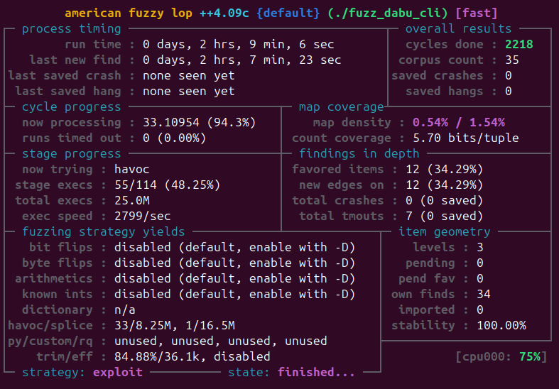
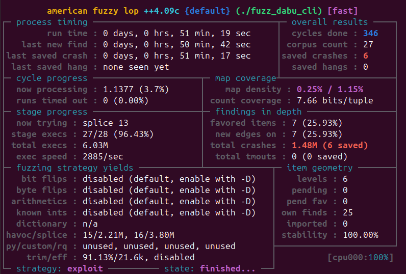

# DABU - .NET Assembly Blob Unpacker
DABU is a tool for unpacking .NET assemblies (DLL files) from an `assemblies.blob` file. It is implemented in C and exposes an interface for easy integration and portability across other programming languages.

- A cli tool can be found under `cli` directory.
- Python bindings can be found under `py` directory.
- Java bindings are planned and currently in the pipe line.

### CLI Build

```sh
cd cli
mkdir build
cd build
cmake ../ -G Ninja
ninja
```

#### Fuzzing

AFL++ were used during development cycle due to the nature of the project (Binary file parser).

Following are the steps to compile CLI using AFL++ and then perform fuzzing sessions.

```sh
mkdir fuzz
cd fuzz
cmake ../ -DFUZZ=ON
```

This will generate a binary with the following name `fuzz_dabu_cli`, the next step is start fuzzing session as follow:

```
afl-fuzz -i in -o out -- ./fuzz_dabu_cli @@
```

Make sure to provide a valid assembly blob file sample in `in` directory.

##### AFL++ session - 7b99dd42d268d8b1826941096e5be55348641003

Several bugs mostly segfaults and asserts were found during the session, no exploitable bugs were idendified.



Fixes were straighforward, following is AFL++ session post-bugfixes



### Python Build

```sh
cd py
py .\setup.py build
py .\setup.py install
```

TODO: fuzz C extension.

See `py/example.py` for usage of `dabu` module.
